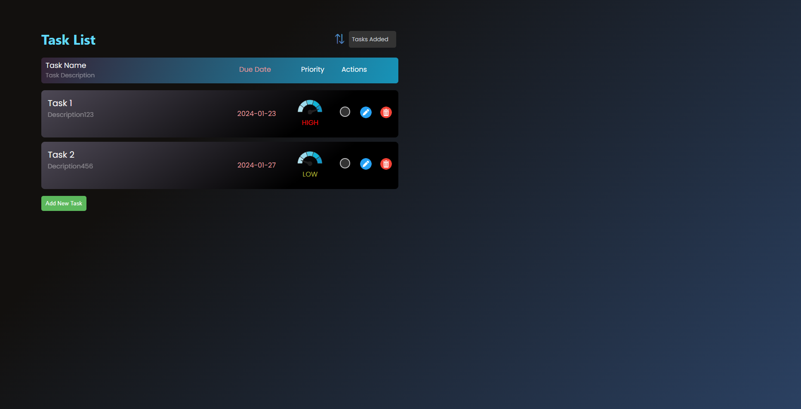
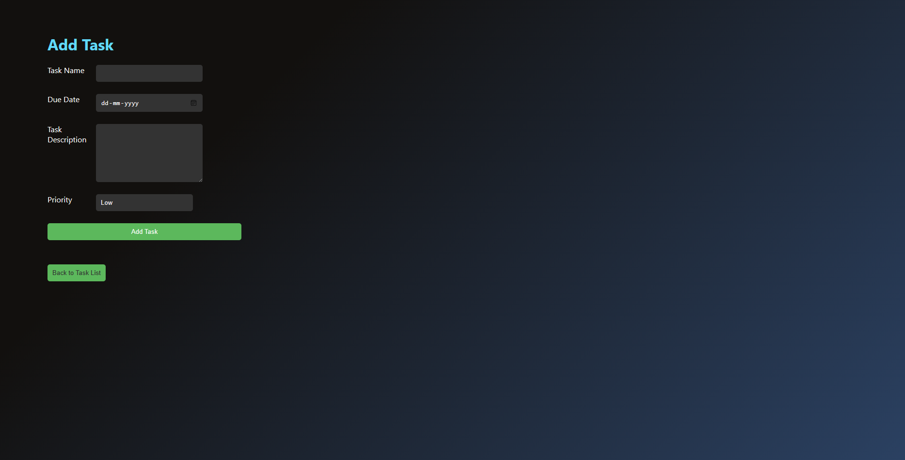
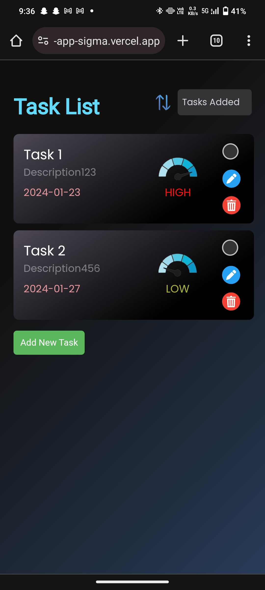
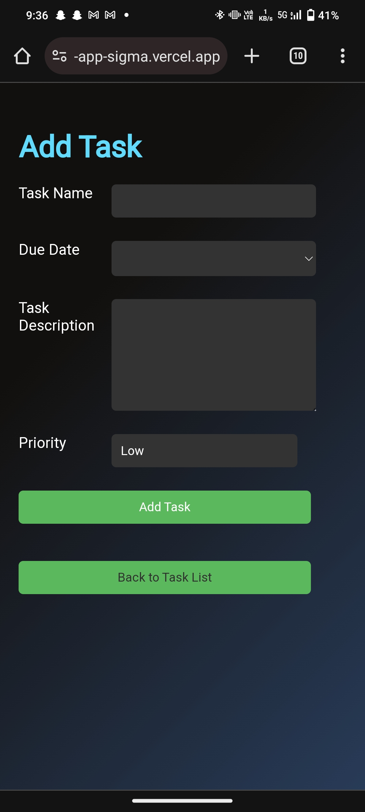

# todoapp
A todo app based on Local Storage. No need of any login , simply open the site and manage your tasks.

In the project directory, you can run:
😎npm i
Installs the necessary dependancies.

😎npm start
Runs the app in the development mode.
Open http://localhost:3000 to view it in your browser.

The page will reload when you make changes.
You may also see any lint errors in the console.

You can view this website on almost all devices like your phone or tablet or PC. Thanks to its responsive design.

Below are some screenshots demonstrating the features of this website .

